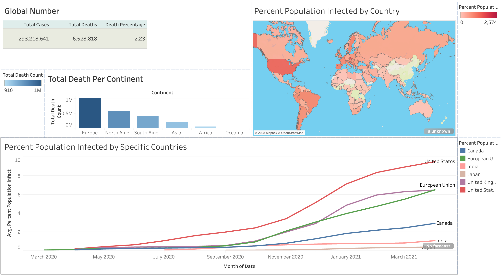

# 🦠 COVID-19 Global Impact Analysis  

## 📌 Table of Contents  
- [Overview](#overview)  
- [Dataset](#dataset)  
- [Problem Statement](#problem-statement)  
- [Tableau Dashboard](#tableau-dashboard)  
- [Key Performance Indicators (KPIs)](#key-performance-indicators-kpis)  
- [SQL Queries](#sql-queries)  
- [Expected Outcomes](#expected-outcomes)  
- [Recommendations](#recommendations)  
- [Tools Used](#tools-used)  

---

## 📊 Overview  

This project analyzes the **global impact of COVID-19**, focusing on **infection rates, death counts, and vaccination progress** across continents and specific countries. Using **MySQL** for data processing and **Tableau** for visualization, the project provides insights into **pandemic trends, regional impacts, and public health responses**.

📌 **Key Insights:**  
- **Total Cases & Deaths** worldwide and across **continents**.  
- **Percentage of Population Infected** per country.  
- **COVID-19 spread over time** across major regions.  
- **Comparison of affected countries** (e.g., USA, Canada, India, Europe).  

---

## 📂 Dataset  

📥 **Download Data**:  
- [`CovidDeaths.xlsx`](./CovidDeaths-revise.xlsx)  
- [`CovidVaccinations.csv`](./CovidVaccinations.csv)  

**Columns Include:**  
- `location` – Country/Region name  
- `continent` – Continent name  
- `date` – Date of reported cases  
- `total_cases` – Cumulative number of cases  
- `total_deaths` – Cumulative number of deaths  
- `population` – Population of the region  
- `total_vaccinations` – Total vaccine doses administered  

---

## ❓ Problem Statement  

The COVID-19 pandemic significantly impacted global health, economies, and daily life. Governments and organizations need **data-driven insights** to make informed decisions regarding **lockdowns, healthcare response, and vaccination rollouts**.

📌 **Key Problems:**  
- How did **COVID-19 spread over time** across different continents?  
- Which **countries had the highest infection and death rates**?  
- What percentage of the **global population was infected**?  
- How effective were **vaccination efforts** in reducing infections?  

By analyzing these questions, this project helps in **understanding pandemic trends and improving crisis response strategies**.  

---

## 📊 Tableau Dashboard  

### **Global Impact Analysis**  
  

📍 **Key Features:**  
- **Global Numbers:** Total cases, deaths, and death percentage.  
- **Total Deaths by Continent:** Visualizing the most affected regions.  
- **World Map of Infections:** Showing infection rates per country.  
- **Infection Trends Over Time:** Tracking COVID-19 spread in major regions.  

🔗 **Live Dashboard:** *[Add Tableau Public Link Here]*  

---

## 📈 Key Performance Indicators (KPIs)  

✔ **Total Cases & Deaths Worldwide**  
✔ **Death Percentage Calculation**  
✔ **Total Deaths per Continent**  
✔ **Country-wise Infection Rates**  
✔ **Time-based COVID-19 Spread**  

---

## 💾 SQL Queries  

### **1️⃣ Total Cases, Deaths, and Death Percentage**  
```sql
SELECT 
    SUM(total_cases) AS Global_Cases, 
    SUM(total_deaths) AS Global_Deaths, 
    (SUM(total_deaths) / SUM(total_cases)) * 100 AS Death_Percentage 
FROM CovidDeaths;
```
📌 Insight: Tracks the overall impact of COVID-19 globally.

### **2️⃣ Total Deaths Per Continent**  
```sql
SELECT 
    continent, 
    SUM(total_deaths) AS Total_Deaths 
FROM CovidDeaths 
WHERE continent IS NOT NULL 
GROUP BY continent 
ORDER BY Total_Deaths DESC;
```
📌 Insight: Identifies the most affected continents based on total deaths.

### **3️⃣ Percentage of Population Infected by Country
```sql
SELECT 
    location, 
    (MAX(total_cases) / population) * 100 AS Percent_Population_Infected 
FROM CovidDeaths 
WHERE continent IS NOT NULL 
GROUP BY location, population
ORDER BY Percent_Population_Infected DESC;
```
📌 Insight: Determines which countries had the highest infection rates based on population percentage.

### **4️⃣ Infection Trends Over Time
```sql
SELECT 
    location, 
    date, 
    total_cases, 
    total_deaths 
FROM CovidDeaths 
WHERE location IN ('United States', 'India', 'Canada', 'European Union') 
ORDER BY location, date;
```
📌 Insight: Helps visualize how infections evolved over time in major regions.

### **5️⃣ Total Vaccinations by Country
```sql
SELECT 
    location, 
    MAX(total_vaccinations) AS Total_Vaccinations 
FROM CovidVaccinations 
WHERE continent IS NOT NULL 
GROUP BY location
ORDER BY Total_Vaccinations DESC;
```
📌 Insight: Measures vaccination efforts across different countries.

## 🎯 Expected Outcomes  

✔ **Understand global COVID-19 trends** and **regional differences** in infections and deaths.  
✔ **Identify the most affected regions** and **high-risk populations**.  
✔ **Measure the impact of vaccinations** on reducing cases and deaths.  
✔ **Provide data-driven insights** for **future pandemic preparedness**.  

---

## 🔹 Recommendations  

### 📌 **Strengthening Pandemic Response**  
- Improve **early detection & lockdown policies** for future outbreaks.  
- Enhance **data transparency** for global health organizations.  

### 📌 **Vaccination Strategy Optimization**  
- Increase **vaccine distribution** to high-risk regions.  
- Implement **booster shot programs** for long-term immunity.  

### 📌 **Healthcare System Preparedness**  
- Invest in **hospital infrastructure** for handling future pandemics.  
- Strengthen **supply chains** for essential medical resources.  

---

## 🛠 Tools Used  

- **MySQL** – Data storage, queries, and trend analysis  
- **Tableau** – Interactive dashboard visualization  
- **Excel** – Data cleaning and preprocessing  


